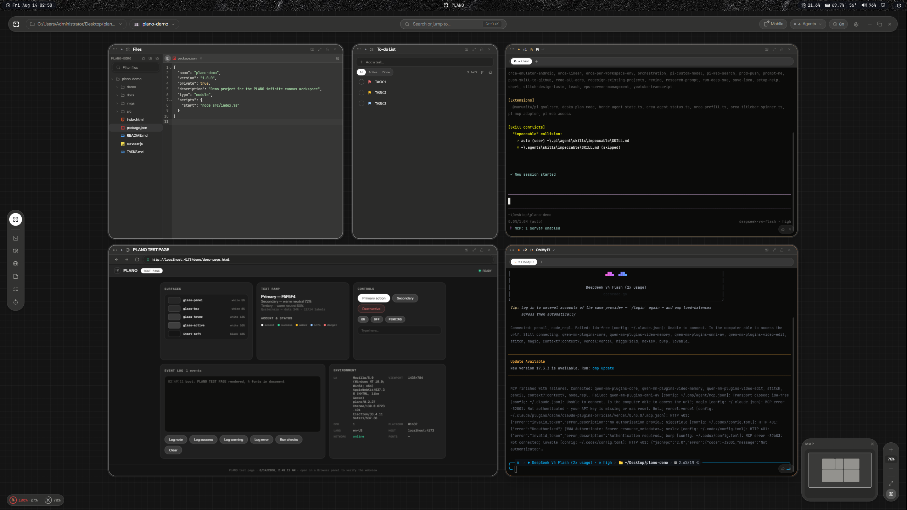
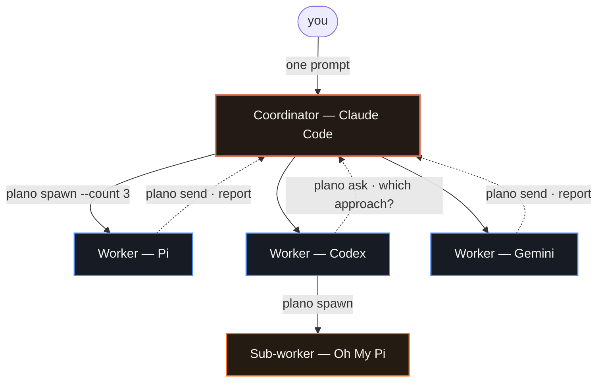
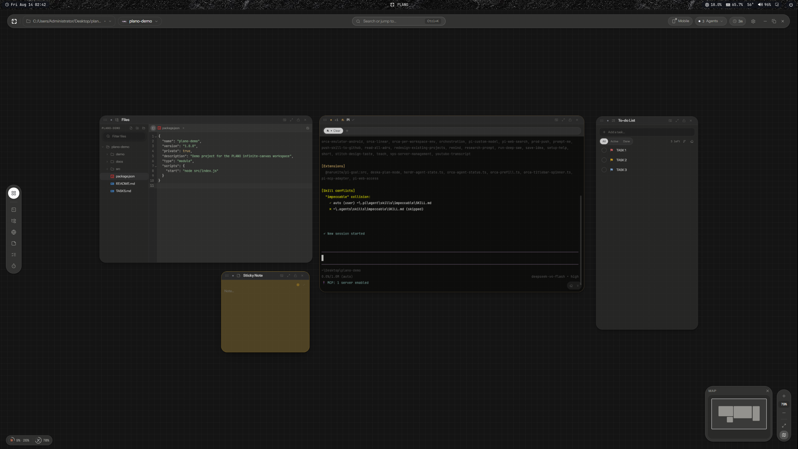
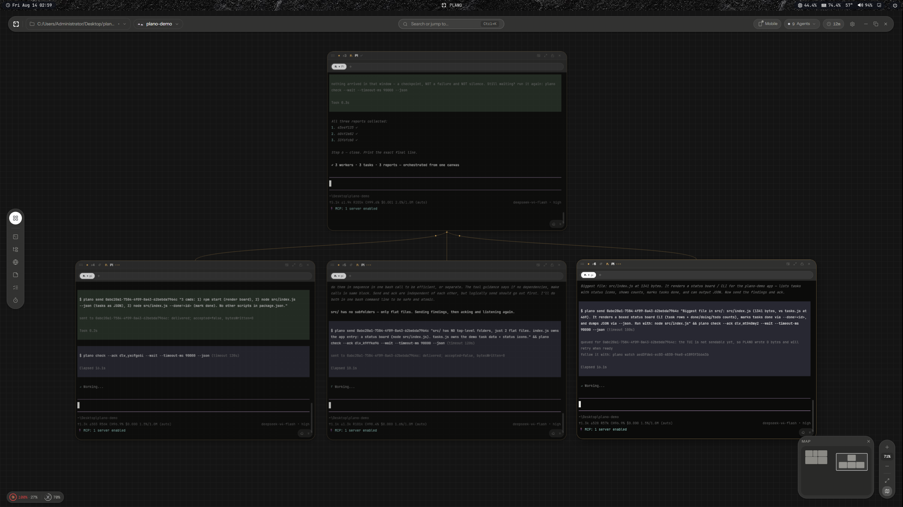
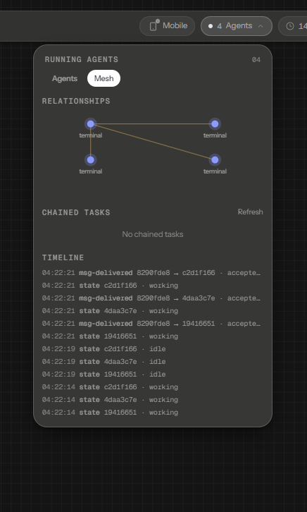

<div align="center">

# PLANO

### The IDE where your AI agents work together — whichever model, whichever CLI

Claude Code hands work to Codex. Codex asks Gemini. Gemini spawns three Pi agents and waits for
all three. **Different vendors, different models, different CLIs — one conversation**, on one
infinite canvas, where you can see all of them at once.

**No account. No cloud. No telemetry.** PLANO drives the AI CLIs you already have, with your own
subscriptions, on your own machine.

[](https://github.com/zqkra/plano/releases/latest)
[](https://github.com/zqkra/plano/releases/latest)
[](https://ko-fi.com/zqkra)

[](https://github.com/zqkra/plano/releases)
[](LICENSE)
[](https://github.com/zqkra/plano/stargazers)
[](https://github.com/zqkra/plano/releases)


</div>

<p align="center">
  
</p>

---

## Download

**[Download the latest release →](https://github.com/zqkra/plano/releases/latest)**

- **Windows** — `.exe` installer. Self-updating: PLANO checks for new releases on launch and
  every 4 hours, downloads in the background, and installs on restart or quit.
- **macOS** — `.dmg` (Apple Silicon). Unsigned CI builds; right-click → **Open** on first launch.

Requires Windows 10 1809+ (for ConPTY) or macOS 12+.

---

## One mesh, any harness

Every AI CLI you open joins the same mesh — Claude Code, Codex, Gemini, Oh My Pi, Grok, Cursor,
OpenCode, Aider, Kiro. They reach each other through one command surface, and **none of them has
to know what the other one is**:

```sh
plano roster                          # everyone running, whatever they are
plano send  <agent> "review this"     # Claude → Codex, Gemini → Pi, any direction
plano ask   <agent> "which approach?" # blocks until they actually answer
plano spawn codex . --count 3         # a Pi agent opening three Codex agents is normal here
```

There is no adapter per vendor and no lowest common denominator. An agent participates because it
can run a command — that is the entire requirement. The one that spawned the others is not special
either: any of them can spawn, ask, delegate and wait on any other.



Solid arrows are work going out, dashed ones are answers coming back. Every arrow is one `plano`
command, and every box is a real terminal on the canvas — placed exactly where the diagram puts it,
because that is how PLANO lays spawned agents out.

That is what turns a pile of terminals into something closer to a **team**: work arrives, gets
split, comes back, and you watch it happen instead of shuttling context between tabs yourself.

## Why a canvas

One agent is a chat window. Five agents is a mess — tabs you cannot see at once, work you cannot
place, and no way to tell who is waiting on whom. PLANO gives that swarm a **shape**:

|  | Terminal tabs | Chat / cloud tools | **PLANO** |
|---|---|---|---|
| See every agent at once | ✗ one at a time | ✗ one thread at a time | ✓ all of them, side by side |
| Who delegated to whom | invisible | invisible | ✓ children open **beneath** their parent |
| Agents talk to each other | ✗ | ✗ | ✓ `send` · `ask` · `reply` · `spawn` |
| Across vendors | ✗ | ✗ one vendor per thread | ✓ Claude ↔ Codex ↔ Gemini ↔ Pi |
| Survives closing the app | ✗ | n/a | ✓ detached host, reattach on reopen |
| Your models, your subscriptions | ✓ | ✗ their inference | ✓ your CLIs, your keys |
| Where your code goes | your machine | **their servers** | ✓ **your machine, always** |

### Everything is local. Not "private by default" — local.

- **No account, no sign-in, no telemetry.** There is nothing to opt out of.
- **PLANO has no model and no API key of its own.** It runs *your* CLIs — Claude Code, Codex,
  Gemini, Oh My Pi — under *your* subscriptions. Your prompts go where they already went.
- **The mesh is loopback.** Agent-to-agent messaging binds to `127.0.0.1`. The only network
  surface is PLANO Mobile on your own Wi-Fi, and it is token-authenticated.
- **Redaction before sharing.** When one agent reads another's transcript, it passes through a
  central redactor (tokens, keys, passwords, PEM blocks) first.
- **Your workspace is a file you own.** Layout lives in `.plano/workspace.json` inside your
  project. Delete the folder and PLANO forgets everything.

## A canvas, not tabs

Panels float on one infinite space per project — terminals, code editors, browsers, markdown,
sticky notes. Pan and zoom. The layout is saved per project, so reopening a folder puts every
panel back exactly where it was.

<p align="center">
  
</p>

## Terminals that become agents

Run Claude Code, Codex, Gemini, Oh My Pi or any other AI coding CLI inside a terminal panel and
PLANO notices — the panel morphs into *agent mode*, tinted with that agent's own accent. No
configuration: detection reads the process tree and the output banner.

<!-- MEDIA SLOT 3 — AGENT MODE. Drop docs/media/agent-mode.png and uncomment:

-->

## Agents that spawn agents — as a map you can read

`plano spawn` opens new agents **below** the one that asked for them, siblings side by side and
centred on their parent. The canvas becomes the org chart of the work: who delegated to whom is
visible from the shape alone, and depth grows downward instead of running off-screen.

<p align="center">
  
</p>

<p align="center"><sub><i>One coordinator, three workers it spawned, three reports back — read off the canvas.</i></sub></p>

## Messages that cannot quietly go missing

A team only works if the messages arrive, so delivery is durable first and typed second:

- **`send` never refuses.** The message is recorded before it is routed, so a peer that is booting,
  mid-turn, or busy still gets it. There is nothing to retry.
- **Waiting is a command, not a state.** An agent listens by blocking on `plano check --wait`;
  when mail arrives it is woken in milliseconds, with the message as that command's own output.
  No polling, no sleeping, no watching the screen.
- **A timeout is a checkpoint, never silence.** It says so in words, so an agent does not conclude
  the mesh is dead and stop listening.
- **A batch replays until acknowledged**, so an agent that dies mid-task loses nothing.

<p align="center">
  
</p>

## Agents survive the app closing

Terminals run in a detached agent host, so quitting PLANO never kills the agents you left
working. Reopen and they reattach — same process, same scrollback. You can also watch and talk
to them from your phone on the same Wi-Fi, with the desktop app closed.

<!-- MEDIA SLOT 6 — MOBILE (optional). Drop docs/media/mobile.png and uncomment:

-->

## Everything on the canvas

| Panel | What it is |
|---|---|
| **Terminal** | Real PTY (ConPTY on Windows). Tabs inside one panel, per-terminal font zoom, themes, and a git badge showing branch + state for its live directory. |
| **Agent** | Any terminal running an AI CLI. Detected automatically, tinted with that agent's accent, and joined to the mesh. |
| **Files** | File tree with an inline code editor (CodeMirror 6, lazy per language) and an image viewer. Create, rename, delete to trash. |
| **Browser** | Electron `<webview>` that transforms with the canvas — a real browser panel, not a screenshot. |
| **Markdown** | Typographic renderer with GFM and fenced code. |
| **Sticky note · Text · Region** | Annotations that live on the canvas ground, behind the panels. |
| **To-do · Pomodoro** | Small utilities that persist with the workspace. |

| Beyond the panels | |
|---|---|
| **Workspaces (spaces)** | Several canvases per project, each with its own layout and colour. |
| **Docking** | Drag one panel onto another to merge them into a split group, VS Code style. |
| **Snapping** | Lego-style align and flush-stick, plus tile zones at the window edges. |
| **Command palette** | `Ctrl+K` for every command; `Alt+<letter>` to create a panel. |
| **Mesh overlay** | `Ctrl+Shift+A` — every running agent, their relationships, and a live delivery timeline. |
| **PLANO Mobile** | View, talk to, create and kill agents from your phone on the same Wi-Fi, with the desktop app closed. |
| **Voice (Odla)** | Local speech control — the model runs on your machine, nothing is uploaded. |
| **Session restore** | Terminals reattach after a restart, and agent conversations can be resumed. |

## Requirements

- **Windows 10 1809+** (ConPTY) or **macOS 12+**
- An AI coding CLI (Claude Code, Codex, Gemini, …) only if you want agent mode — plain
  terminals work standalone.

## Auto-updates

Installed PLANO builds self-update from this repo's
[Releases](https://github.com/zqkra/plano/releases). One repo: the code you are reading and the
installer you download. No tokens are needed on client machines because the repo is public.

---

## Development

### Stack

| Layer | Tech |
|---|---|
| Runtime | Electron 33 + electron-vite |
| UI | React 18 + TypeScript + Tailwind CSS 3 |
| Canvas state | zustand + immer |
| Terminals | `@xterm/xterm` (WebGL) + `node-pty` (ConPTY on Windows) |
| Editor | CodeMirror 6 (lazy per-language) |
| Browser panels | Electron `<webview>` (DOM-transformable) with a `WebContentsView` fallback |
| Validation | zod (every IPC payload + on-disk schema) |

### Getting started

```bash
npm install
npm run rebuild   # build node-pty against Electron's ABI (run once after install / after Electron upgrades)
npm run dev       # launch PLANO with HMR
```

> **Windows:** `node-pty` needs the *Desktop development with C++* workload (VS Build Tools) if
> no prebuilt binary is available, and Windows 10 1809+ (ConPTY).

### Scripts

| Script | Purpose |
|---|---|
| `npm run build` | Production build into `out/` |
| `npm run typecheck` | Type-check main+preload and renderer projects (the only gate) |
| `npm run build:web` | Build the PLANO Mobile web app into `web-dist/` |
| `npm run dist` | Build + package an installer with electron-builder |
| `npm run release:win` | Build the Windows installer **and publish it** as a GitHub release |

Publishing a new version (the whole release flow):

```bash
npm run release:win                       # build installer + publish v<version> (uses your gh CLI)
node scripts/publish-release.mjs         # publish artifacts already in release/ (no rebuild)
node scripts/publish-release.mjs --platform mac   # publish macOS artifacts (dmg + zip + latest-mac.yml)
node scripts/publish-release.mjs --replace        # delete + re-publish an existing vX release
```

The release must be tagged `v<version>` (the script does this) and **not** a draft/prerelease —
electron-updater ignores those. Mac builds include a `zip` target because macOS updates need it.
`dist*` scripts build locally with `--publish never`; only `release*` uploads.

### Architecture (one screen)

```
renderer (Chromium, sandboxed)  ──window.plano──▶  preload (bridge)  ──IPC──▶  main (Node, privileged)
  React canvas + panels                 typed invoke/on            services: PtyManager, AgentDetection,
  zustand stores                        (contextBridge)            Workspace, FileSystem, Git, Browser…
```

- `src/shared` — types + IPC contracts shared by both sides. **Zero** node/electron/dom imports.
- `src/main` — privileged Node process. Owns PTYs, process inspection, FS, git, persistence.
- `src/preload` — the **only** bridge. Exposes a frozen, typed `window.plano`.
- `src/renderer` — the UI: infinite-canvas engine, one folder per panel type, app chrome, stores.

See the [documentation index](docs/README.md), [architecture](docs/architecture/ARCHITECTURE.md),
and [design system](docs/design/DESIGN_SYSTEM.md) for the full specification.

### Security posture

`contextIsolation: true`, `nodeIntegration: false`, `sandbox: true`. The renderer is treated as
untrusted: every IPC payload is zod-validated in main; embedded web content runs in an isolated
session partition with denied permissions by default. See the SecurityService section in the
architecture doc.

### Agent Mesh

PLANO's cross-workspace agent coordination: detect any AI coding CLI running in a terminal
(Claude Code, Codex, Gemini, Oh My Pi, Grok, …), see them all from one overlay (`Ctrl+Shift+A`),
and let them coordinate with each other through the `plano` CLI.

- **CLI-first, no MCP.** Any harness that can run a command participates — no server handshake,
  no config files to merge. The CLI speaks JSON-RPC to the agent host over loopback, and identity
  rides the terminal environment.
- **Delivery is durable, not typed-and-hoped.** A message is recorded before it is routed, so a
  peer that is booting, mid-turn or parked on `plano check --wait` still receives it. `send`
  never refuses.
- **Receiving is a blocking call, not a poll.** `plano check --wait` returns the moment mail
  arrives; a timeout is an explicit checkpoint, never mistaken for silence.
- **Context lives in the agent host** — it keeps working with the desktop app closed, and every
  tail, transcript and search passes through one redactor (tokens/keys/passwords/PEM) before it
  reaches another agent.

Privacy: nothing leaves your machine. The mesh binds to loopback; the LAN surface (PLANO Mobile)
is token-authenticated.

## Support

PLANO is free and open source. If it saves you time, you can
[buy me a coffee](https://ko-fi.com/zqkra) — entirely optional, and it changes nothing about the
app: no paid tier, no locked features, no telemetry either way.

## License

MIT — see [LICENSE](LICENSE).
