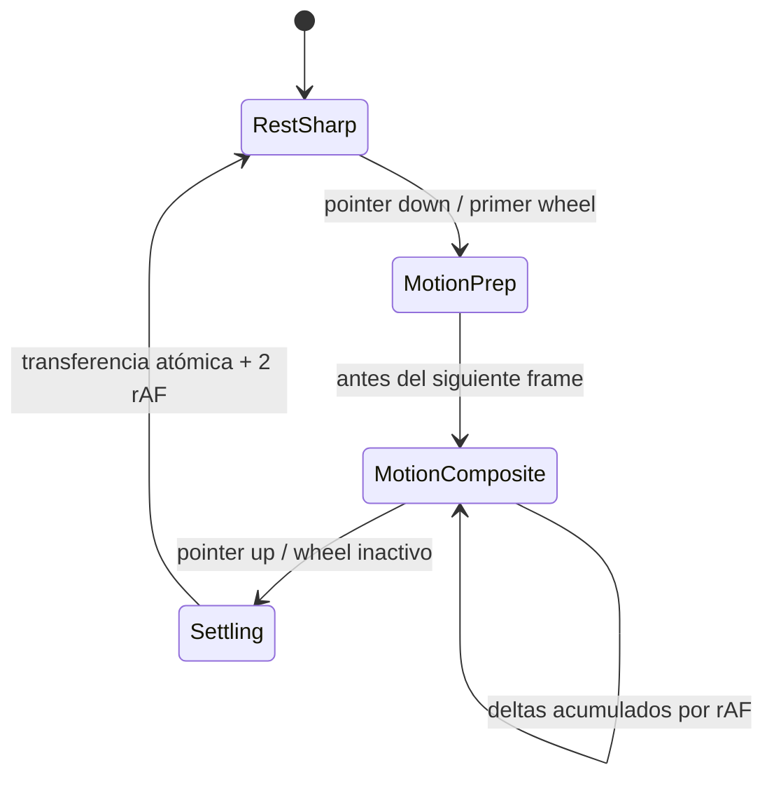

# Plan maestro: nitidez a cualquier escala y movimiento fluido del canvas

> **SUPERADO:** no implementar la arquitectura de vidrio dinámico descrita en este documento.
> La dirección aprobada es el cristal óptico estático y unificado de
> [`PLAN_OPTICAL_GLASS_UNIFIED_RENDER.md`](./PLAN_OPTICAL_GLASS_UNIFIED_RENDER.md).

**Estado:** propuesta técnica lista para implementación  
**Proyecto:** PLANO Desktop (Electron 33 + Chromium + React + Zustand)  
**Objetivo principal:** eliminar la apariencia borrosa o de baja calidad al alejar el canvas y conseguir paneo/zoom visualmente continuo, sin perder el efecto de cristal, la precisión espacial ni el estado vivo de terminales, editores y webviews.

---

## 1. Resultado esperado

Al completar este plan, PLANO debe cumplir simultáneamente estas condiciones:

1. El contenido que todavía sea útil a una escala determinada debe verse nítido al terminar el gesto de zoom.
2. El contenido real de cada panel debe permanecer visible a cualquier zoom. Está prohibido ocultarlo o cubrirlo con tarjetas-resumen; la optimización debe actuar sobre composición y rasterización, no sustituir la interfaz.
3. Arrastrar el canvas debe mover la escena en el siguiente frame disponible y no debe producir una actualización React/Zustand por cada evento físico del mouse.
4. Durante el movimiento se debe transformar una sola capa compuesta del mundo, no recalcular la transformación de cada panel en cada frame.
5. Al terminar el movimiento, la escena debe pasar de forma atómica al modo de reposo nítido y reactivar el cristal real sin saltos visuales.
6. Terminales, CodeMirror, webviews, paneles agrupados, regiones, etiquetas, minimapa, snapping y coordenadas del puntero deben conservar su comportamiento.
7. La solución debe funcionar en la build instalada de Windows con aceleración de hardware habilitada, no únicamente en el servidor de desarrollo.

---

## 2. Síntomas que se deben resolver

### 2.1 Texto y contenido de baja calidad al alejarse

- A escalas como la usada normalmente en el workspace actual, aproximadamente `0.56`, las letras de terminales, editores, archivos, notas y cabeceras parecen rasterizadas o borrosas.
- La calidad mejora cuando el usuario se acerca mucho al panel.
- El problema no es solo el tamaño aparente: la combinación de escalado fraccional, capas compuestas, filtros y contenido previamente rasterizado reduce la nitidez.
- En un terminal de 13 px, un zoom de `0.56` produce un glifo aparente de solo `7.28 px`. La solución debe mejorar la rasterización y permitir acercarse con fluidez, pero nunca ocultar el terminal ni reemplazarlo por una tarjeta opaca.

### 2.2 Paneo extremadamente lento

- El paneo por `pointermove` escribe en Zustand en cada evento físico.
- Un mouse de alta frecuencia puede emitir cientos o miles de eventos por segundo, aunque la pantalla solo pueda presentar 60, 120 o 144 frames por segundo.
- Cada escritura cambia `x` o `y`, vuelve a renderizar `PanelLayer`, actualiza variables CSS heredadas y obliga a Chromium a reconsiderar las transformaciones de todos los elementos del mundo.
- Durante la interacción se aplica `will-change: transform` a cada panel, grupo, región y etiqueta. Esto puede crear muchas capas de composición y presión de memoria GPU.
- Aunque el blur se desactiva durante el gesto, el costo de React, propagación de estilos, composición de múltiples capas, terminales WebGL y webviews continúa.

---

## 3. Hechos comprobados en el código actual

Este diagnóstico parte del estado real del repositorio y no de una arquitectura hipotética.

### 3.1 Cámara y frecuencia de actualizaciones

- `src/renderer/stores/useViewportStore.ts` guarda `{ x, y, zoom, isPanning, interacting }`.
- `CanvasRoot.tsx` ejecuta `panBy(...)` directamente dentro de cada `onPointerMove`.
- `usePanZoom.ts` ya agrupa correctamente los eventos de rueda con `requestAnimationFrame`, pero el paneo por arrastre todavía no usa ese mecanismo.
- `PanelLayer.tsx` está suscrito a `x`, `y`, `zoom`, `interacting` e `isPanning`; por tanto, se vuelve a renderizar durante cada actualización publicada de cámara.
- `GridBackground.tsx`, `SnapOverlay.tsx`, `Minimap.tsx`, `ViewControls.tsx` y otros consumidores también se suscriben a partes de la cámara.

### 3.2 Transformación distribuida

Para conservar el backdrop blur real en Windows, cada elemento del mundo aplica actualmente una matriz equivalente a:

```text
T(camera.x, camera.y) × S(camera.zoom) × T(panel.x, panel.y)
```

Esto ocurre en:

- `PanelFrame.tsx`
- `DockGroupFrame.tsx`
- `RegionFrame.tsx`
- `TextLabelFrame.tsx`

La decisión corrigió el cristal, porque un ancestro común transformado se convertía en backdrop root y el filtro dejaba de muestrear el fondo real. Sin embargo, ahora una modificación de cámara afecta la transformación calculada de cada panel.

### 3.3 Capas y cristal

- Durante `interacting`, `PanelLayer` publica `--viewport-will-change: transform` para todos los elementos.
- `globals.css` desactiva correctamente `backdrop-filter` bajo `[data-viewport-interacting='true'] [data-glass]`.
- En reposo, el `backdrop-filter` está en el mismo elemento transformado que contiene todo el contenido del panel.
- Un filtro aplicado al contenedor completo puede forzar una superficie de composición que incluye texto y contenido, reduciendo las oportunidades de rasterización nítida de los descendientes.

### 3.4 Rango de zoom y contenido pesado

- El zoom permitido va de `0.1` a `3` en `geometry.ts`.
- xterm usa WebGL, pero `snapRenderScale()` retorna siempre `1.0`; el atlas de glifos se transforma visualmente con el canvas.
- CodeMirror mantiene su scroll durante zoom mediante una suscripción directa a la cámara.
- Los paneles browser contienen `<webview>`, que es especialmente costoso de recomponer.
- El grid recalcula tamaños y posiciones de gradientes con cada cambio React de cámara.

---

## 4. Hipótesis ordenadas por impacto

Estas hipótesis deben validarse con trazas antes y después de cada fase.

| Prioridad | Hipótesis | Evidencia actual | Prueba que la confirma |
|---|---|---|---|
| P0 | El paneo publica demasiadas actualizaciones de cámara | `CanvasRoot.onPointerMove` llama `panBy` directamente | La traza muestra más commits de store que frames presentados |
| P0 | Se están moviendo muchas capas individuales en cada frame | Cada panel recibe una transformación dependiente de variables de cámara y `will-change` | `LayerTree` muestra crecimiento proporcional al número de paneles y tiempo alto de composite |
| P0 | El filtro del contenedor reduce la nitidez del contenido | El elemento transformado con blur contiene toda la UI | Separar temporalmente placa y contenido mejora capturas en reposo |
| P1 | El escalado fraccional produce rasterización inevitable de texto pequeño | A `0.56`, una fuente de 13 px termina en 7.28 px | Capturas a escalas fijas muestran pérdida aunque se eliminen filtros |
| P1 | Terminal WebGL y webviews dominan el costo con varios paneles | Ambos generan superficies pesadas | La traza mejora al reemplazarlos temporalmente por placeholders |
| P2 | Grid, spotlight y overlays añaden repaint innecesario | Gradientes y máscaras cambian con la cámara | Desactivar cada capa individualmente reduce Paint o Raster |
| P2 | La aceleración de hardware puede estar deshabilitada en algunas instalaciones | Existe un ajuste que llama `app.disableHardwareAcceleration()` | `chrome://gpu` o CDP confirma software rendering |

No se debe declarar una hipótesis como causa definitiva sin adjuntar una medición reproducible.

---

## 5. Arquitectura objetivo

La solución recomendada usa dos modos de renderizado de cámara y una máquina de estados explícita.



### 5.1 `RestSharp`: calidad máxima en reposo

- El contenedor común del mundo no tiene transformación de cámara.
- Cada panel aplica su matriz final de cámara y posición, como ocurre actualmente.
- El contenido se rasteriza después de retirar las pistas temporales de composición.
- El cristal real está activo.
- La placa de cristal y el contenido deben ser superficies hermanas, no contenido descendiente del elemento que aplica el filtro.
- El nivel de detalle depende del zoom asentado.

### 5.2 `MotionComposite`: una sola capa móvil

- El contenedor común del mundo aplica `T(camera) × S(zoom)`.
- Cada panel conserva únicamente su transformación estática `T(panel.x, panel.y)`.
- El blur real se desactiva y se mantiene el wash visual barato existente.
- La transformación de cámara se escribe imperativamente una vez por frame.
- React no vuelve a renderizar la colección de paneles durante el gesto.
- Zustand no recibe una escritura por cada `pointermove`.
- El grid recibe sus variables de cámara por escritura DOM imperativa en el mismo frame.

### 5.3 Transferencia sin salto entre modos

Las dos expresiones deben producir exactamente la misma matriz visual:

```text
Modo reposo:
panelTransform = T(camera.x, camera.y) × S(camera.zoom) × T(panel.x, panel.y)

Modo movimiento:
worldTransform = T(camera.x, camera.y) × S(camera.zoom)
panelTransform = T(panel.x, panel.y)
```

La transición se hace en una sola escritura coordinada antes de pintar el frame. Al finalizar:

1. Copiar la cámara viva al estado persistido.
2. Escribir la matriz final en las variables de reposo.
3. Quitar la matriz del mundo y cambiar los paneles a modo reposo en la misma tarea.
4. Esperar dos `requestAnimationFrame` para que Chromium rasterice el contenido asentado.
5. Reactivar el backdrop blur.
6. Retirar `will-change`.

No debe existir un frame donde se apliquen simultáneamente la cámara del mundo y la cámara individual completa.

---

## 6. Diseño del controlador de cámara

Crear un controlador único, por ejemplo `src/renderer/canvas/ViewportController.ts`, con estas responsabilidades:

```ts
interface LiveViewport {
  x: number
  y: number
  zoom: number
}

interface ViewportController {
  getLive(): LiveViewport
  begin(kind: 'pointer-pan' | 'wheel-pan' | 'wheel-zoom'): void
  enqueuePan(dx: number, dy: number): void
  enqueueZoom(anchor: { x: number; y: number }, factor: number): void
  end(kind: 'pointer-pan' | 'wheel-pan' | 'wheel-zoom'): void
  cancel(): void
  subscribeSettled(listener: (viewport: LiveViewport) => void): () => void
}
```

### 6.1 Reglas internas

- Mantener una cámara viva mutable que siempre refleje el frame más reciente.
- Acumular `dx`, `dy` y el producto de zoom hasta el siguiente frame.
- Programar como máximo un callback de `requestAnimationFrame` simultáneo.
- Aplicar paneo y zoom anclado usando la cámara viva, no un snapshot React obsoleto.
- Publicar a Zustand al terminar el gesto y, si la interfaz necesita un porcentaje de zoom vivo, como máximo a una frecuencia separada de 15 o 30 Hz.
- El autosave debe escuchar la cámara asentada; no debe serializar 60 veces por segundo.
- `cancel()` debe vaciar el frame pendiente, transferir el último valor válido y restablecer `RestSharp`.
- `pointercancel`, pérdida de captura, cambio de workspace, cierre de ventana y HMR deben pasar por `cancel()`.

### 6.2 Consumidores que necesitan cámara viva

Las rutas que realizan geometría durante un gesto no pueden depender de un estado asentado antiguo. Deben leer `ViewportController.getLive()`:

- Conversión screen-to-world del menú contextual.
- Drag y resize de paneles.
- Snapping y docking.
- Coordenadas de regiones y etiquetas.
- Corrección de mouse de xterm.
- Apertura de paneles en la posición del cursor.
- Comandos que enfocan o centran elementos.

Los componentes puramente informativos pueden usar el snapshot asentado o una publicación de baja frecuencia.

---

## 7. Separación de cristal y contenido

No se debe volver a colocar un `backdrop-filter` dentro de un ancestro transformado permanente, porque eso reproduce el fallo de Windows que dejó el grid sin desenfoque.

### 7.1 Estructura recomendada por panel

Cada entrada de z-index debe agrupar dos superficies hermanas:

```text
PanelStackSlot (posicionado, crea el orden z, no tiene transform ni filter)
├── PanelGlassPlate (transform final + backdrop-filter, sin contenido interactivo)
└── PanelContentSurface (misma transform final, sin backdrop-filter)
```

Condiciones obligatorias:

- `PanelStackSlot` no debe usar `transform`, `filter`, `backdrop-filter`, `perspective`, `contain: paint` ni `isolation` si cualquiera crea un backdrop root que impida muestrear el canvas.
- `PanelGlassPlate` pinta blur, saturación, borde, wash y sombras de fondo.
- `PanelContentSurface` pinta cabecera, controles, terminal, editor y demás contenido.
- Ambas superficies comparten dimensiones, radio, z-index local y matriz de posición.
- Los eventos pertenecen únicamente a `PanelContentSurface`; la placa usa `pointer-events: none`.
- Durante movimiento, el filtro de `PanelGlassPlate` se desactiva antes de promover el mundo.
- En reposo, verificar por CDP que el estilo calculado de la placa sea el blur esperado y que el grid detrás aparezca realmente desenfocado.

### 7.2 Orden z correcto

Cada par placa/contenido debe formar una unidad de apilamiento. El contenido de un panel inferior nunca puede dibujarse encima de la placa de un panel superior. La prueba debe incluir paneles parcialmente superpuestos, grupos, sticky notes y un browser webview.

### 7.3 Terminal

- La cabecera usa la placa general de cristal.
- El cuerpo conserva su negro translúcido moderado.
- El blur interno del cuerpo se puede desactivar durante movimiento junto con el resto de filtros.
- No reintroducir el escalado de fuente/caja de xterm sin resolver primero las carreras de scroll documentadas en `engine/render.ts`.

---

## 8. Nitidez sin ocultar el contenido

La vista lejana sigue siendo el workspace real. Terminales, editores, archivos, notas, browsers y controles permanecen dibujados dentro de sus paneles en todo el rango de zoom. No se permite un modo `compact` u `overview` que use `visibility: hidden`, `display: none`, opacidad cero o un overlay opaco para reemplazar el contenido.

### 8.1 Estrategia permitida

- Mantener la cámara dual: una capa compuesta durante movimiento y rasterización nítida al asentarse.
- Separar la placa de cristal del contenido para que el filtro no degrade los descendientes.
- Retirar `will-change` y la transformación del mundo después de dos frames de asentamiento.
- Alinear traslaciones asentadas a píxeles físicos cuando no cambie el anclaje.
- Mantener xterm WebGL y CodeMirror montados y visibles.
- Reducir trabajo fuera de pantalla, pero restaurarlo antes de entrar al viewport mediante overscan.
- Si se añade información ampliada para navegación, debe ser un indicador pequeño y no oclusivo; nunca puede cubrir la superficie del panel.

### 8.2 Criterio visual por escala

Las capturas a `0.35`, `0.50`, `0.56`, `0.75`, `1.0` y `1.5` deben mostrar exactamente la misma interfaz real, con la reducción geométrica esperada. A `0.56` deben seguir siendo visibles las líneas de terminal, el árbol de Files, el texto de Sticky y el reloj de Pomodoro, aunque algunos detalles sean naturalmente pequeños.

### 8.3 Lo que no debe usarse como “arreglo”

- No añadir `translateZ(0)` a todos los elementos.
- No mantener `will-change` permanentemente.
- No usar `image-rendering` para texto.
- No forzar un `deviceScaleFactor` global fijo.
- No cuantizar agresivamente el zoom sin conservar el punto ancla.
- No aumentar todas las fuentes del contenido completo; rompería layout, terminal grid y editor.
- No habilitar el render-scale de xterm por pasos sin pruebas de scrollback, selección, mouse reporting y PTY resize.
- No montar `PanelOverview` sobre el contenido real.
- No aplicar `invisible` al cuerpo o a la cabecera según el zoom.

---

## 9. Culling y reducción de trabajo fuera de pantalla

Esta fase se implementa después de conseguir una cámara de una sola capa. Solo debe conservarse si las trazas demuestran una mejora adicional.

### 9.1 Cálculo

- Convertir el viewport de pantalla a un rectángulo world-space usando la cámara viva.
- Añadir overscan equivalente a 300 px de pantalla.
- Clasificar paneles como `visible`, `overscan` u `offscreen`.
- Recalcular como máximo una vez por frame durante movimiento y publicar el conjunto únicamente cuando cambie.

### 9.2 Política segura por contenido

- Paneles simples: no montar el contenido pesado fuera del overscan.
- Terminales: desacoplar el DOM usando el registro persistente existente; no destruir PTY, xterm ni scrollback.
- Editores: preservar documento, selección, historial y scroll antes de desacoplar la vista.
- Browser webviews: mantener sesión y navegación; probar `visibility`, `content-visibility` y parking DOM antes de considerar un unmount.
- Paneles con agentes activos: conservar las señales de estado aunque su contenido visual esté desacoplado.
- Las placas overview pueden permanecer como geometría barata si ayudan a navegar con zoom muy lejano.

---

## 10. Plan de implementación por fases

Cada fase debe producir una medición, una captura y un cambio reversible. No mezclar todas las optimizaciones en un único parche.

### Fase 0 — Fixture y línea base

1. Crear un workspace de benchmark aislado con composiciones fijas de 4, 12 y 30 paneles.
2. Incluir al menos dos terminales activos, dos editores, un browser, Files, Sticky, Pomodoro, Todo, un grupo, una región y una etiqueta.
3. Ejecutar en build de producción con userData temporal y aceleración de hardware habilitada.
4. Registrar `devicePixelRatio`, tamaño de ventana, refresh rate, GPU renderer, zoom y cantidad de paneles.
5. Capturar trazas de paneo horizontal y diagonal de cinco segundos a zoom `0.56` y `1.0`.
6. Guardar capturas estáticas en las escalas definidas en la sección 8.1.

### Fase 1 — Instrumentación

1. Añadir un medidor de frames de desarrollo activado por flag, no visible en producción normal.
2. Medir frame time p50, p95 y p99, frames superiores a 33 ms, long tasks y duración total del gesto.
3. Contar publicaciones de cámara, renders de `PanelLayer`, renders de paneles y cambios de nivel de detalle.
4. Usar CDP `LayerTree` para contar capas durante reposo y movimiento.
5. Usar una traza Chromium con categorías de rendering, paint, raster y compositor.
6. Documentar el cuello dominante antes de modificar la arquitectura.

### Fase 2 — Coalescing completo de entrada

1. Reemplazar el `panBy` directo de `CanvasRoot.onPointerMove` por `ViewportController.enqueuePan`.
2. Migrar la acumulación existente de rueda al mismo controlador.
3. Garantizar como máximo una aplicación de cámara por frame.
4. Mantener pointer capture y todos los finales/cancelaciones.
5. Verificar que la distancia total recorrida sea idéntica incluso cuando llegan varios eventos antes de un frame.

### Fase 3 — Cámara dual

1. Añadir los estados `rest`, `motion-prep`, `motion` y `settling`.
2. En movimiento, aplicar la cámara únicamente al contenedor del mundo.
3. Cambiar paneles a transformaciones estáticas de world-space.
4. Evitar suscripciones React de `PanelLayer` a cada frame vivo.
5. Actualizar grid y spotlight por CSS imperativo desde el controlador.
6. Transferir la cámara a Zustand al asentarse.
7. Comprobar igualdad visual de matrices en cada cambio de modo.

### Fase 4 — Placa de cristal separada

1. Dividir `PanelFrame` y `DockGroupFrame` en slot, placa y contenido hermanos.
2. Aplicar el blur solamente a la placa.
3. Mantener la placa sin eventos.
4. Desactivar filtros antes de entrar en `motion`.
5. Reactivar filtros dos frames después del asentamiento.
6. Verificar blur real, nitidez de texto y apilamiento con paneles superpuestos.

### Fase 5 — Visibilidad completa a cualquier zoom

1. Mantener cabecera y cuerpo real visibles en todo el rango `0.1–3`.
2. Prohibir overlays de reemplazo dependientes del zoom.
3. Confirmar que terminales, Files, Sticky y Pomodoro conservan su contenido a `0.56`.
4. Validar estabilidad visual en las seis escalas de referencia.
5. Medir la cámara dual con el contenido real visible para asegurar que la fluidez no dependía de ocultarlo.

### Fase 6 — Contenido pesado y culling

1. Medir terminales, editores y webviews de forma aislada.
2. Aplicar desacople DOM o culling solo a los tipos que mantengan su estado correctamente.
3. Mantener overscan para que no aparezca contenido tarde al entrar en pantalla.
4. Comparar la traza de 30 paneles con la Fase 5.

### Fase 7 — Pulido del compositor

1. Limitar `will-change` a la única capa mundial durante movimiento.
2. Retirarlo por completo en reposo, salvo animaciones locales activas.
3. Alinear la traslación asentada a píxeles físicos cuando no altere el anclaje: `round(value * dpr) / dpr`.
4. Evaluar el grid sin máscara de spotlight durante movimiento si Raster continúa alto.
5. Reducir la frecuencia del minimapa durante el gesto si aparece en la traza.

### Fase 8 — Regresión, empaquetado e instalación

1. Ejecutar `npm run typecheck`.
2. Ejecutar `npm run build`.
3. Ejecutar el benchmark automatizado contra la build de producción.
4. Generar capturas comparativas y un JSON de métricas.
5. Empaquetar Windows.
6. Instalar mediante `release/win-unpacked` según la limitación documentada del instalador en esta máquina.
7. Repetir la verificación sobre el ejecutable instalado.

---

## 11. Archivos que probablemente cambiarán

### Núcleo de cámara

- `src/renderer/canvas/ViewportController.ts` — nuevo controlador imperativo.
- `src/renderer/stores/useViewportStore.ts` — separar cámara viva de snapshot asentado.
- `src/renderer/canvas/CanvasRoot.tsx` — enviar gestos al controlador.
- `src/renderer/canvas/hooks/usePanZoom.ts` — unificar rueda y paneo en el controlador.
- `src/renderer/canvas/PanelLayer.tsx` — implementar los dos modos de transformación.
- `src/renderer/canvas/GridBackground.tsx` — recibir cámara viva por CSS imperativo.

### Superficies y visibilidad lejana

- `src/renderer/panels/_base/PanelFrame.tsx`
- `src/renderer/canvas/DockGroupFrame.tsx`
- `src/renderer/panels/region/RegionFrame.tsx`
- `src/renderer/panels/label/TextLabelFrame.tsx`
- `src/renderer/styles/globals.css`

### Integraciones sensibles

- `src/renderer/panels/terminal/engine/TerminalEngine.ts`
- `src/renderer/panels/terminal/engine/render.ts`
- `src/renderer/panels/terminal/canvasZoomMouse.ts`
- `src/renderer/panels/editor/useCodeMirror.ts`
- `src/renderer/canvas/SnapOverlay.tsx`
- `src/renderer/canvas/Minimap.tsx`
- `src/renderer/app/actions.ts`
- `src/renderer/app/layout.ts`
- `src/renderer/app/workspaceActions.ts`

No todos estos archivos necesitan modificarse. La IA implementadora debe cambiar solo los consumidores que realmente necesiten cámara viva o un nuevo nivel de detalle.

---

## 12. Benchmark reproducible

### 12.1 Escenarios

| ID | Paneles | Zoom | Entrada | Duración |
|---|---:|---:|---|---:|
| B1 | 4 | 1.00 | Paneo horizontal | 5 s |
| B2 | 12 | 0.56 | Paneo diagonal | 5 s |
| B3 | 30 | 0.56 | Paneo circular sintetizado | 10 s |
| B4 | 12 | 0.35 → 1.50 | Zoom anclado repetido | 8 s |
| B5 | 12 | 1.00 | Paneo sobre terminal y webview | 5 s |
| B6 | 30 | 0.35 | Paneo rápido de extremo a extremo | 10 s |

### 12.2 Métricas mínimas

- Frame time p95 menor o igual a `16.7 ms` en una pantalla de 60 Hz para B1 y B2.
- Frame time p99 menor a `25 ms` para B1 y B2.
- Ninguna long task superior a `50 ms` durante paneo normal.
- Una sola escritura visual de cámara por frame como máximo.
- Cero renders de componentes de contenido causados únicamente por `x` o `y` durante `MotionComposite`.
- La cantidad de capas que cambian de transformación por frame debe ser constante respecto al número de paneles; objetivo: una capa mundial y las capas fijas estrictamente necesarias.
- El cursor y el canvas no deben separarse más de un frame presentado.
- El cambio de `motion` a `rest` no puede producir desplazamiento superior a `0.5 px` físico.

### 12.3 Métricas de nitidez

- En todo el rango `0.1–3`, la cabecera y el cuerpo real deben permanecer visibles y no ocluidos.
- A `zoom = 0.56`, deben verse el contenido del terminal, el árbol de Files, la nota y Pomodoro; no una tarjeta-resumen.
- Al terminar el gesto, el contenido completo debe rasterizarse nuevamente y no permanecer como una textura del movimiento.
- Las capturas repetidas con la misma cámara deben ser estables, sin oscilación de un píxel por redondeo.
- El blur del cristal debe desaparecer durante movimiento y reaparecer en reposo sin cambiar el layout.

---

## 13. Matriz de pruebas funcionales

### Cámara

- Paneo izquierdo, botón medio, rueda libre, Ctrl/Meta + rueda, Shift + rueda y Alt + rueda.
- Zoom anclado: el punto bajo el cursor permanece fijo.
- Cancelación por `pointercancel` y pérdida de captura.
- Cambio de workspace durante una interacción.
- Zoom to fit, focus panel, reset y minimapa.

### Paneles

- Mover y redimensionar en todos los niveles de zoom.
- Docking, undocking, snapping de borde y grupos divididos.
- Orden z estable y selección de texto intacta.
- Abrir, cerrar y animar paneles durante reposo.

### Terminal

- Scrollback, selección, enlaces, mouse reporting de TUI y copy/paste.
- Resize del panel sin cambios inesperados de filas/columnas durante zoom de canvas.
- Cambio de tab y reattach de sesiones.
- Agente activo conservado al pasar a compact/overview.

### Editor

- Scroll vertical y horizontal conservado durante zoom.
- Cursor, selección, IME, búsqueda y undo/redo.
- No recrear CodeMirror innecesariamente al alternar niveles.

### Browser

- Navegación, sesión, formularios, video y foco después de salir y entrar del viewport.
- Webview correctamente alineado durante paneo y zoom.
- Ningún panel inferior pinta encima de un webview superior.

### Apariencia

- Todos los temas, modo claro, acentos, sticky tones y agentes coloreados.
- Hardware acceleration activada y comportamiento degradado documentado cuando el usuario la desactiva.
- Reduced motion sin romper la transferencia entre modos.
- Grain, grid styles y spotlight sin regresiones.

---

## 14. Riesgos y mitigaciones

| Riesgo | Consecuencia | Mitigación |
|---|---|---|
| Doble aplicación de la cámara al cambiar de modo | Salto o teletransporte de paneles | Prueba matemática de matrices + captura frame a frame |
| Backdrop root accidental | El cristal vuelve a ser transparencia sin blur | Inspeccionar ancestors y estilo calculado en la build instalada |
| Demasiadas capas hermanas placa/contenido | Memoria GPU elevada | Medir `LayerTree`; mantener placas sin `will-change` en reposo |
| LOD destruye estado vivo | Terminal/editor/browser pierden sesión o scroll | Separar estado/runtime de representación; no destruir motores |
| Estado Zustand atrasado | Acciones usan coordenadas incorrectas durante el gesto | Toda geometría interactiva lee `getLive()` |
| Re-raster tardío | Texto permanece borroso al soltar | Secuencia de asentamiento de dos frames y prueba de captura |
| Culling muestra pop-in | Panel aparece tarde al entrar | Overscan y precalentamiento antes del borde visible |
| xterm cambia filas/columnas | TUI dañada o scrollback incorrecto | No tocar layout de xterm por zoom de cámara; pruebas específicas |
| Webview domina composición | Paneo sigue lento con browsers | Medir y aplicar política específica de visibilidad/preservación |

---

## 15. Orden de decisión para la IA implementadora

1. Medir la build actual.
2. Corregir primero la frecuencia de entrada.
3. Implementar la cámara dual.
4. Volver a medir antes de tocar contenido.
5. Separar placa de cristal y contenido.
6. Volver a medir y comparar nitidez.
7. Confirmar visibilidad completa a distancia sin overlays de reemplazo.
8. Aplicar culling solo si el benchmark de 30 paneles todavía incumple objetivos.
9. Validar terminal, editor y webview antes de empaquetar.
10. Verificar de nuevo en la instalación real de Windows.

Si una fase no produce una mejora medible o introduce una regresión, debe revertirse de forma aislada. El resultado correcto no es acumular trucos CSS, sino reducir trabajo por frame y controlar explícitamente cuándo Chromium compone una textura en movimiento y cuándo vuelve a rasterizar contenido nítido.

---

## 16. Definición de terminado

El trabajo solo se considera completo cuando existen estos artefactos:

1. Código de la cámara dual con ciclo de vida y cancelación completos.
2. Paneo por puntero y rueda unificados bajo rAF.
3. Placa de cristal separada sin pérdida de backdrop blur.
4. Contenido real siempre visible para terminal, editor, browser, Files, Sticky, Todo, Pomodoro, grupos, regiones y etiquetas.
5. Benchmark antes/después con los seis escenarios.
6. Capturas comparativas en las seis escalas.
7. Resultados de `npm run typecheck` y `npm run build` exitosos.
8. Matriz funcional aprobada para terminal, editor y webview.
9. Build de Windows instalada y medida.
10. Confirmación visual de que el paneo es fluido y que el contenido asentado permanece visible, sin tarjetas que lo cubran, incluso al alejarse.
